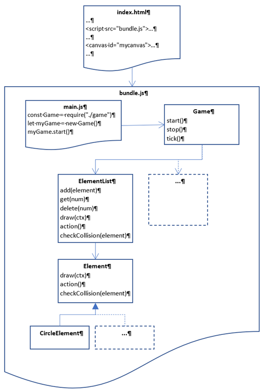

# browsergame-baseapp

The browsergame-baseapp is a tiny client-side application that may serve as a starting point to develop your own browsergame. 
It has an educational focus and provides some basic, object-oriented infrastructure. 

How to start
------------
To start the demo, simply open the file public/index.html in a webbrowser of your choice.

The example uses the tool browserify/watchify to pack all clientside-code into one file named bundle.js.
If you change code, use watchify to update bundle.js.
First, install watchify by

    >npm install -g watchify

Then start it from the project directory by

    >watchify ./client/main.js -o ./public/bundle.js

Watchify observes all your javascript files. 
Whenever a file changes, it automatically builds a new bundle.js.
The latter command is included in package.json and hence can be started from tools like visual studio code.

